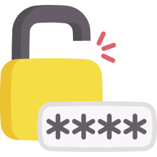
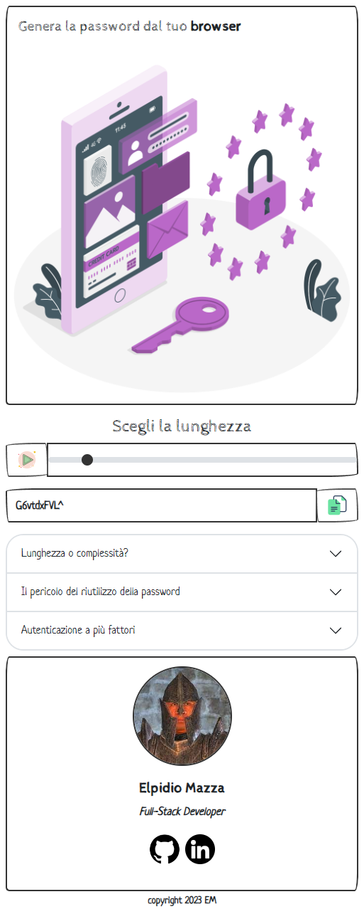

## Browser Extension, Variable Length Password Generator

## Why this extension
This is simple tool for generating strong and secure passwords.

With this extension, you can easily generate secure and strong passwords. You can choose the length of the password and modify it as desired. Finally, you can copy it with a simple click.

Additionally, you will find useful tips to understand the importance of choosing a password.

**This extension was created using the Angular framework and is the new version of the plugin. The old version was created using only JavaScript.**

## Download the plugin directly from the Chrome Web Store

TODO

## How you can use the extension locally without downloading it from the Chrome Web Store

- Download the "Dist" folder and extract the content.
- Go to your browser's settings and select "Manage extensions" (e.g., brave://extensions/ for Brave browser).
- Click on "Load unpacked extension" (if this option is not available, you may need to enable developer mode).
- Choose the "PasswordGenerator" folder that you downloaded earlier.
- If everything went well, you will find the extension among your installed extensions.

- Note: The steps may vary slightly depending on the browser you are using. Make sure to follow the specific instructions for your browser.

### Other reference sites

- Initialization package [Extensionizr](https://extensionizr.com/)
- https://www.security.org/how-secure-is-my-password/
- https://haveibeenpwned.com/
- A special thanks to this guide that helped me solve the security issue (content security policy directive) https://www.justjeb.com/post/chrome-extension-with-angular-from-zero-to-a-little-hero 
- Style by [Bootsrap](https://getbootstrap.com/)  and Theme by [Bootswatch](https://bootswatch.com/)
- Icon by [Icon8](https://icons8.com/), Illustration by [Storyset](https://storyset.com/)