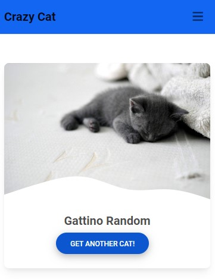
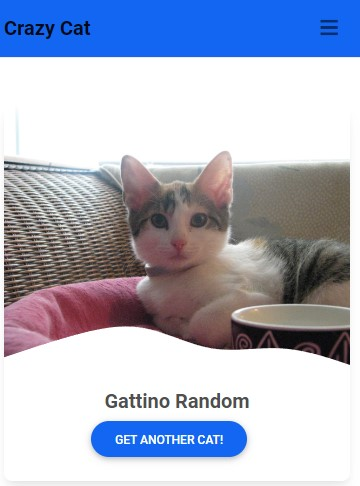

# crazy-cat

Api usate
https://cataas.com/?ref=publicapis.dev#/

Usato un content script per rimpiazzare tutte le immagini quando viene caricata una pagina

Usato Background script per il menu e per il fetch del gattino random
